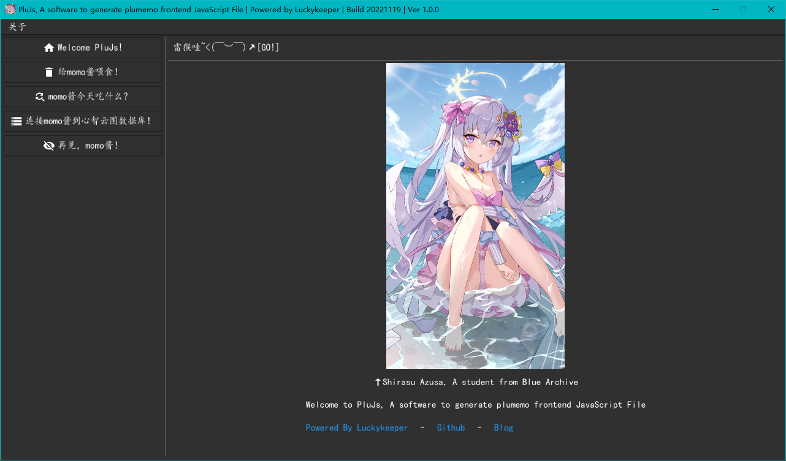
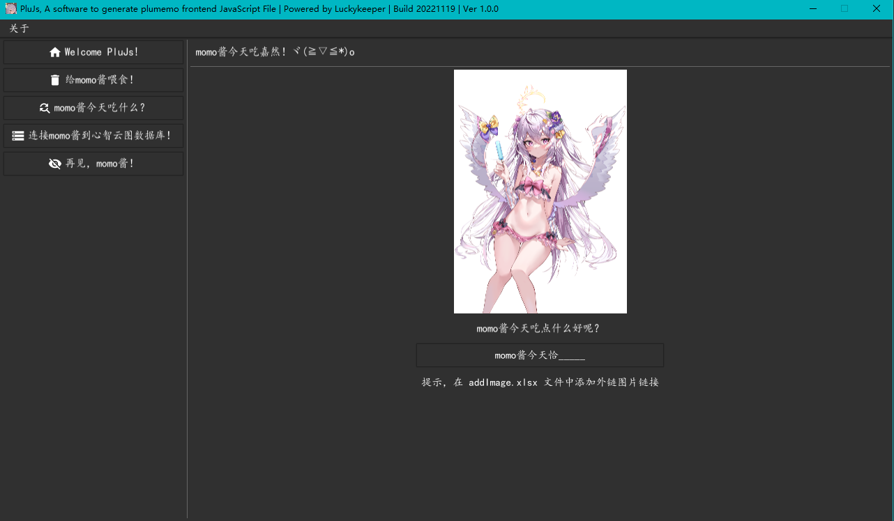
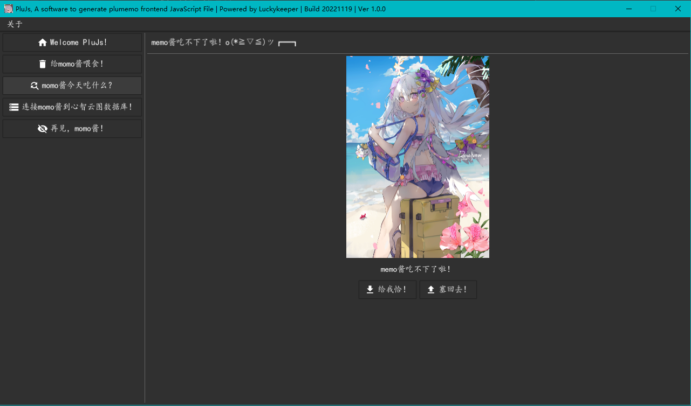
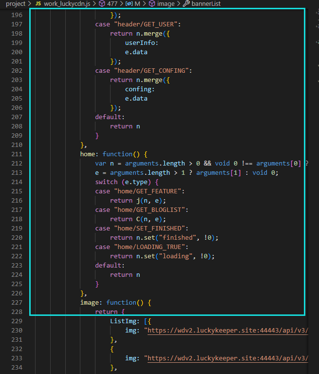
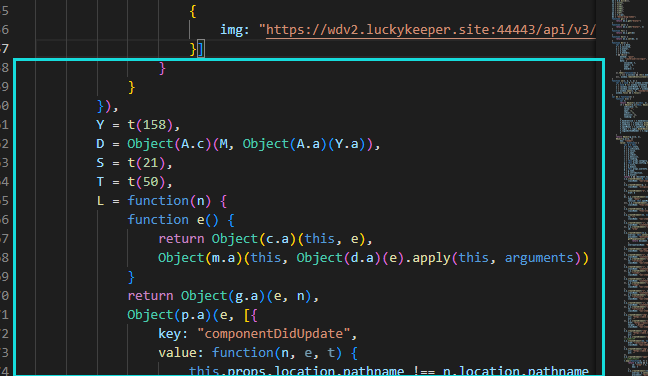
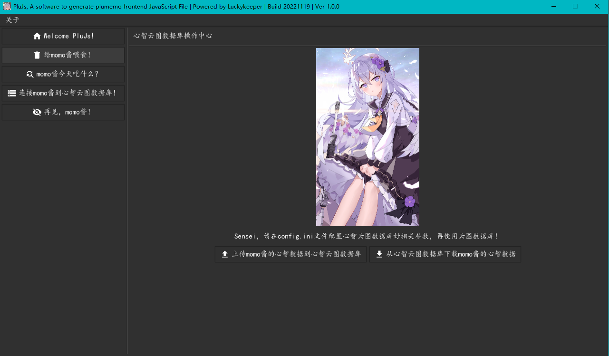

# PluJs
为 plumemo 博客生成前端文件并管理轮播和文章随机图片 | A software to generate plumemo frontend JavaScript File

项目为个人自用需要编写并开源，你可以在 MIT 协议下随意使用，如果帮助到你，请点亮右上角的 Star ⭐

## 注意事项

PluJs 仅适用于 **React 版前端 Plumemo（theme-react-sakura 主题，非 ssr 版本）**或通过一键脚本（包含使用[我的 Docker 镜像](https://github.com/luckykeeper/docker_plumemo)）安装的 Plumemo ，在其它主题的 Plumemo 使用可能会导致未知问题！使用前请知悉

项目基于某个内部项目略加改动而来，里面可能会有奇奇怪怪的文字说明，懒得大改了（#查询你游玩家成分）2333

## 功能简介

theme-react-sakura 主题将轮播图（banner）和未指定展示图的文章（ListImg）的随机图片链接存储在前端文件（main.3a574d82.chunk.js）中。这导致管理、更换这些图片变得比较复杂，前端文件中存在大量的圆、方、花括号，很容易因为漏写导致更新文件后博客无法正常显示，同时为管理这些图片（增删改）带来了巨大的负担。

通过使用 PluJs ，你可以简单的管理这些图片，便利地对这些图片进行增（添加图片）、删（删除图片）、改（修改已有图片的链接），并一键生成前端文件。同时，同步功能可以让你在多台电脑之间同步这些数据，方便随时随地进行管理

## 使用说明

> Tips：请严格按照使用说明操作，以下说明顺序为菜单顺序

### 1、欢迎界面

 
界面截图
   

没啥好说的，水梓可爱捏~

### 2、添加图片界面

 
添加界面截图
   

确保同目录下存在模板文件 `addImage_Template.xlsx` 首次使用需要点击一下按钮，然后在生成的 `addImage.xlsx` 文件中按照格式分类添加图片（其中共通就是指轮播和文章图都使用的图片），之后保存 Excel 文件，再次点击按钮，添加成功

### 3、输出及修改界面

 
输出及修改界面截图
   

左边的“给我恰！”用来输出前端 JavaScript 文件和 Excel 文件；而右边的“塞回去！”可以把修改后的数据同步回本地数据库

使用“给我恰！”功能前请先填充 `frontendBefore.txt` 和 `frontendAfter.txt` 文件内的内容

`frontendBefore.txt` 文件内存放 ListImg 前的内容（是否压缩混淆均可）

 
示意图片
   

`frontendAfter.txt` 文件内存放 banner 那个方括号后面的内容（是否压缩混淆均可）

 
示意图片
   

使用“塞回去！”功能需要先使用“给我恰！”功能生成 `fileList.xlsx` 文件后，根据该文件的指示完成删改操作，保存文件后再点击按钮

### 4、同步界面

 
同步界面截图
   

左边的上传可以把本地数据库的数据拉取到云端，右边的下载可以把云端的数据拉取到本地，上传时请确保本地数据为最新数据，下载时请确保云端数据是最新数据

使用这个功能前你需要

- 配置程序同目录下的 `config.ini` （文件内有填写说明）
- 搭建云端数据库（使用 postgreSQL 数据库（提示：不会用 pgsql 的可以使用宝塔管理），不需要使用 SQL 文件初始化，仅开放给外部 IP 读写即可，注意使用强密码保证数据安全）

### 5、退出按钮

没啥好说的，另外右键任务栏托盘上面的 logo 也可以退出
